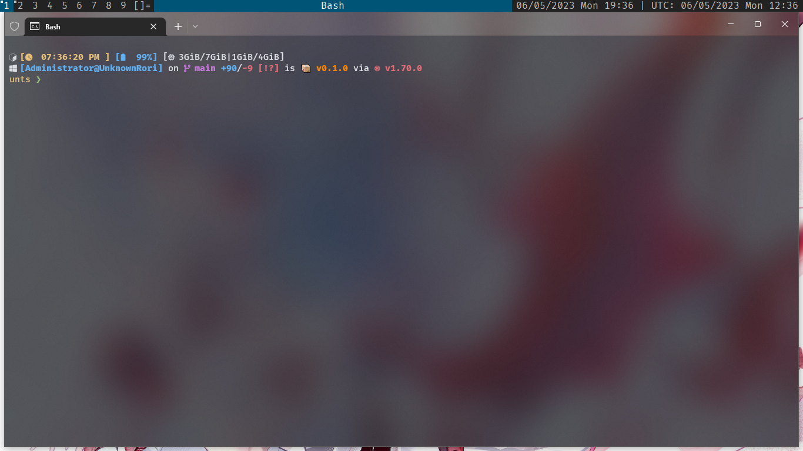
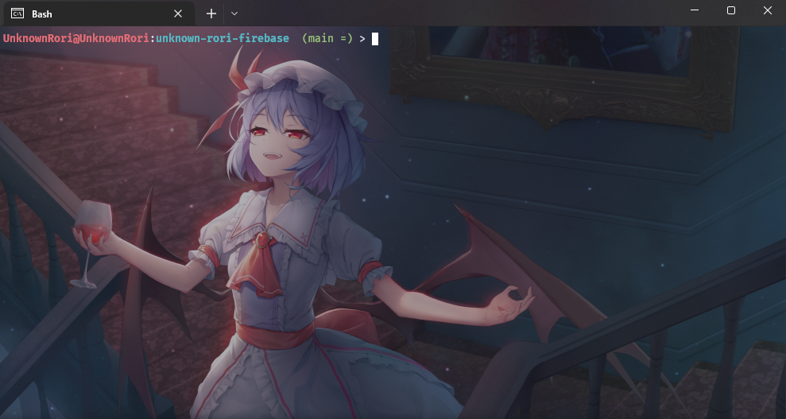
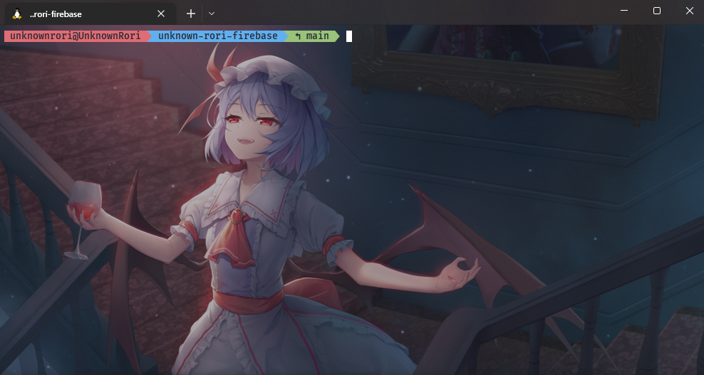
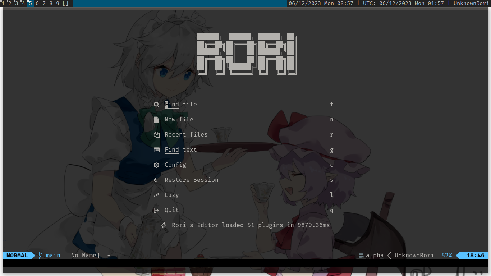

# Dotfiles

[](https://github.com/XAMPPRocky/tokei)


It's collection of my bash script, zsh themes, bash config, zsh config, Visual Studio Code Config, Vim & Neovim Config, and some wallpaper/background for desktop and Visual Studio Code.

## Usage

Just copy the file onto yours(Don't forget to backup so you can go back if the configuration is not suited for you), for scripts you can put it into path for easy access

## Starship



## Bash



## Zsh



## Neovim



I use [Neovide](https://neovide.dev/) to make my Neovim blazingly fast

## 🖼️ Visual Studio Code Preview

<https://user-images.githubusercontent.com/68576836/201878177-73f3d284-2ea5-4d5c-be65-27d9e255e468.mp4>

```md
Font                : Fira code

Color Theme         : Community Material Theme Ocean High Contrast

Product Icon Theme  : Material Product Icon
```

<video src="preview/vscode-preview.mp4" controls title="Visual Studio Code Preview"></video>

### Keybinding

There is a lot of keybind for Visual Studio Code since it's combination of VIM keybind and Visual Studio Code's Custom Keyboard Shortcut, i will put it later, but remember using my keyboard shortcut is shutting down arrow key on your VSCode.
