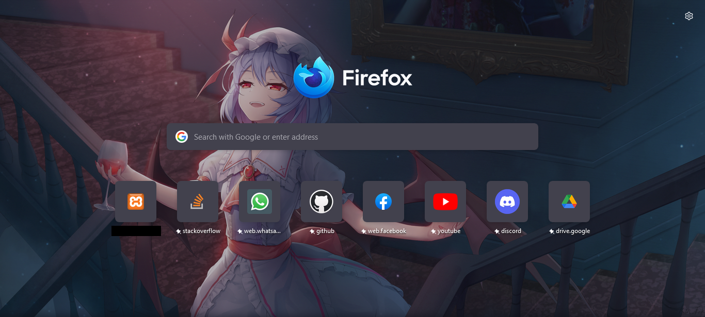
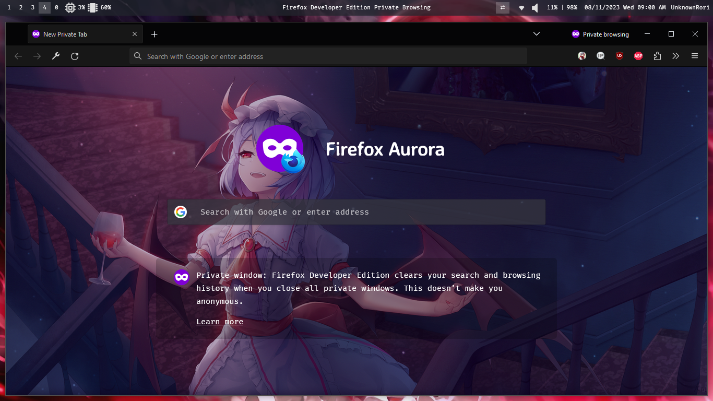

# Customizing Firefox

## Adding background

- open `about:profiles` on firefox
- open folder on `Root Directory` in default profile
- and then copy `chrome` folder from this repository to `Root Directory`
- open `about:config` on firefox
- set `toolkit.legacyUserProfileCustomizations.stylesheets` to true

## Installing Theme

[Theme Sauce](https://color.firefox.com/?theme=XQAAAAIsAQAAAAAAAABBqYhm849SCia2CaaEGccwS-xMDPr1apqUaaq-qy5QgqeHG4K15QdllBokmgjiM6AAxM3VIEJq1UZiTZ_DECaQZYlN6LbeOrS3J8fX05LMSkOBbCbKmU1_Z6Q3tMd9hR2EsCwAWLcCDLLlMrPikuBoryA1PVCHfBwnQPBeRzGACXNE6FKbWZLNxx_-oWGR_q27aRN9z0h232oDD40VRPtBTY6BPlXglwjJ7gF6FN7GWL2h_xYRdLLEje-7CNcRmUG__4DlYAA)

TODO!

## 🖼️ Preview

