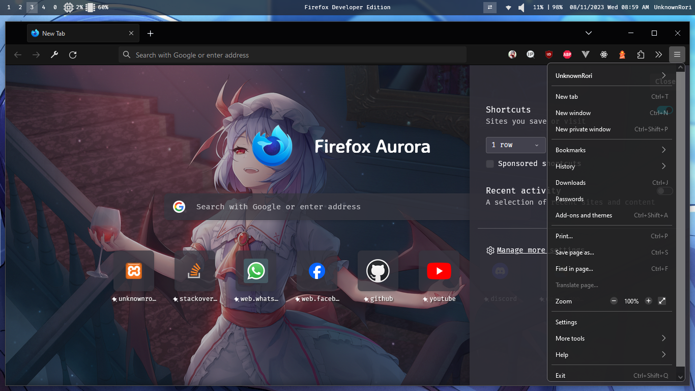

# Customizing Firefox

## Adding background

- open `about:profiles` on firefox
- open folder on `Root Directory` in default profile
- and then copy `chrome` folder from this repository to `Root Directory`
- open `about:config` on firefox
- set `toolkit.legacyUserProfileCustomizations.stylesheets` to true

## 🖼️ Preview

